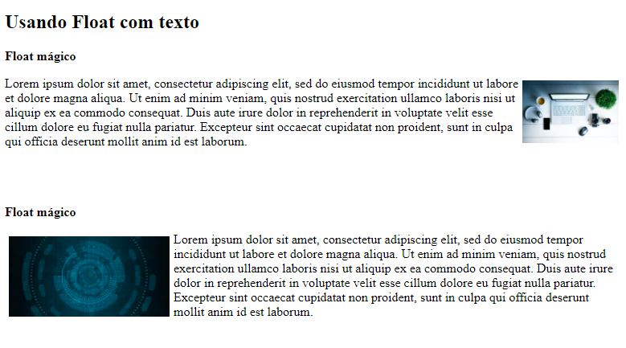

    

# Teste de Performance 3

## Exercício 13 - Combinando Float com textos

Observe a imagem!
Combine um layout com imagens e textos utilizando a ***propriedade Float***. Escolha as imagens e textos, uma deve estar exibida a esquerda e outra a direita.
