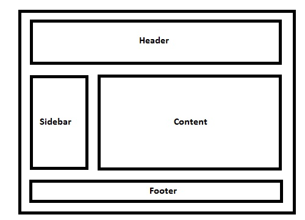

    

# Teste de Performance 3

## Exercício 14 - Desenvolvimento de Layout Simples

Observe a imagem!
Desenvolva um layout simples com blocos com background com cores diferentes, por bloco. Use as técnicas vistas até aqui, como por exemplo, a ***propriedade Float e a propriedade Position***. 
Use a imagem abaixo como referência do posicionamento e quantidade de blocos.

  